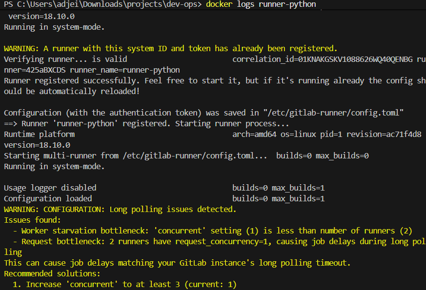
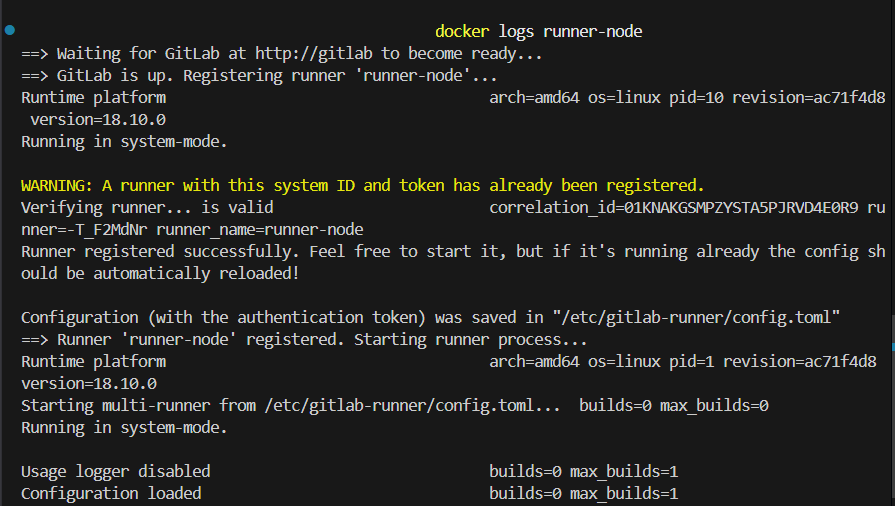
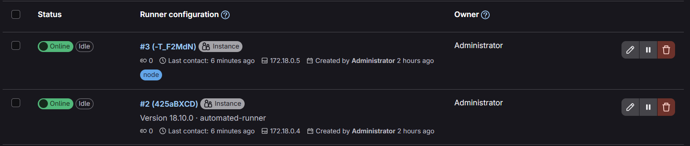

# Automated Multi-Runner Setup

This covers running two GitLab runners automatically, one for Python jobs and one for Node jobs, with no manual token steps in the UI.

## The problem with manual registration

The standard setup requires you to go into the GitLab admin UI, create a runner, copy the `glrt-` token, paste it into your `.env`, then start the runner container. Two runners means doing that twice.

The goal here is to automate that. You fill in one thing (your root password), run one script, and both runners register themselves.

## How it works

### Token generation (`scripts/bootstrap-tokens.sh`)

The bootstrap script runs after GitLab is up. Here is what it does step by step:

1. Waits for GitLab to respond at `http://localhost`
2. Uses `docker exec` to run a Ruby snippet inside the GitLab container via `gitlab-rails runner`. This creates a short-lived personal access token (PAT) for the root user programmatically, no UI needed.
3. Uses that PAT to call the GitLab REST API (`POST /api/v4/user/runners`) twice, once for the Python runner and once for the Node runner. Each call returns a `glrt-` token.
4. Writes both tokens into your `.env` file

The key insight is that `gitlab-rails runner` lets you run arbitrary Ruby code inside the GitLab Rails app. GitLab itself is a Rails app, so all of its internal models are available. Creating a personal access token is just calling `user.personal_access_tokens.create!`.

### Runner registration (`runners/register.sh`)

Each runner container starts with this script as its entrypoint. It:

1. Polls `http://gitlab` until GitLab is reachable (the container name resolves via Docker DNS)
2. Calls `gitlab-runner register --non-interactive` with the token from the environment
3. Hands off to `gitlab-runner run` which starts listening for jobs

The `--non-interactive` flag means no prompts. All config comes from environment variables set in `docker-compose.yml`.

### Why two runners

Each runner is tagged. The Python runner has tag `python`, the Node runner has tag `node`. Jobs in `.gitlab-ci.yml` use the `tags` field to say which runner should pick them up.

This matters because you want Python jobs running in a Python container and Node jobs running in a Node container. One generic runner with no tags would work but you lose that control.

| Runner | Tag | Default image |
|--------|-----|---------------|
| runner-python | python | python:3.12 |
| runner-node | node | node:20 |

## Setup

### Step 1 — Configure your environment

```bash
cp .env.example .env
```

Open `.env` and set your root password:

```
GITLAB_ROOT_PASSWORD=your-password-here
```

### Step 2 — Start GitLab

```bash
docker compose up -d gitlab
```

Watch logs until you see `gitlab Reconfigured!`:

```bash
docker logs -f gitlab
```

Takes 3 to 5 minutes.

### Step 3 — Run the bootstrap script

```bash
./scripts/bootstrap-tokens.sh
```

This generates the runner tokens and writes them to your `.env` automatically.

### Step 4 — Start the runners

```bash
docker compose up -d runner-python runner-node
```

Watch each runner register:

```bash
docker logs runner-python
docker logs runner-node
```

Both should show `Runner registered successfully` then `Listening for jobs`.





### Step 5 — Verify

Go to Admin Area > CI/CD > Runners. Both runners should be Online.



## CI pipeline

Jobs use `tags` to route to the right runner:

```yaml
python:test:
  stage: test
  image: python:3.12
  tags:
    - python
  script:
    - pip install -r requirements.txt
    - pytest

node:test:
  stage: test
  image: node:20
  tags:
    - node
  script:
    - npm ci
    - npm test
```

A job with no matching runner tag will sit pending forever. Always check Admin > Runners if a job does not start.

## Troubleshooting

**Bootstrap script fails with "Failed to create a personal access token"**

The GitLab container is not fully up yet. Wait another minute and retry.

**Runner fails with "reserved configuration" error**

You are using a `glrt-` token with flags like `--tag-list` or `--run-untagged`. These are set in the GitLab UI now, not at registration time. The bootstrap script handles this correctly by setting tags via the API when creating the runner.

**Docker Desktop not running**

```
open //./pipe/dockerDesktopLinuxEngine: The system cannot find the file specified.
```

Launch Docker Desktop, wait for "running", then retry.

## Resources

- [GitLab Runner registration docs](https://docs.gitlab.com/runner/register/)
- [GitLab Runners API](https://docs.gitlab.com/ee/api/users.html#create-a-runner)
- [GitLab CI/CD YAML reference](https://docs.gitlab.com/ee/ci/yaml/)
- [Conventional Commits spec](https://www.conventionalcommits.org)
