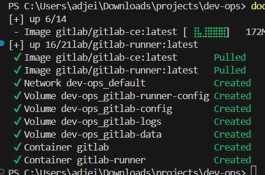
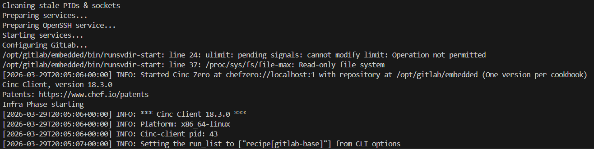
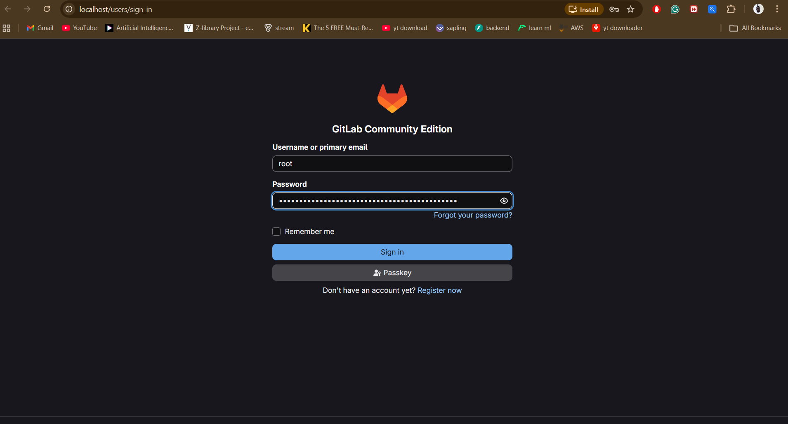
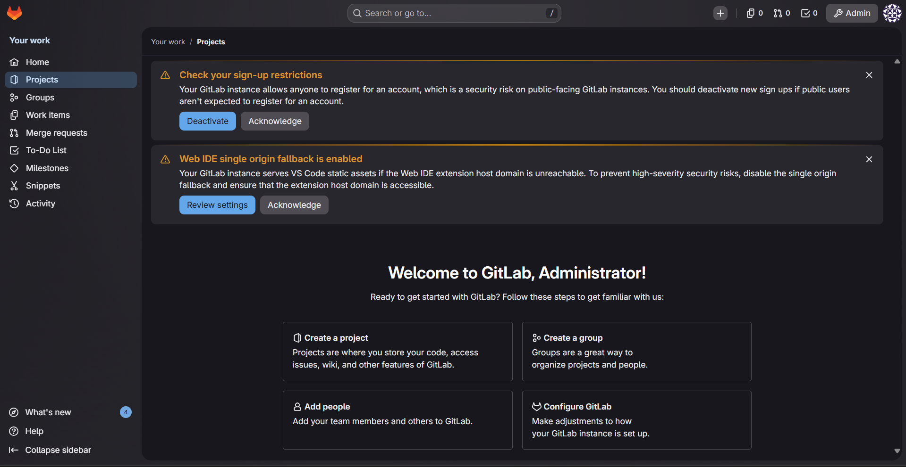
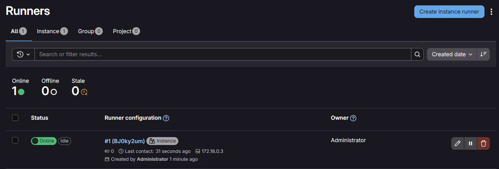
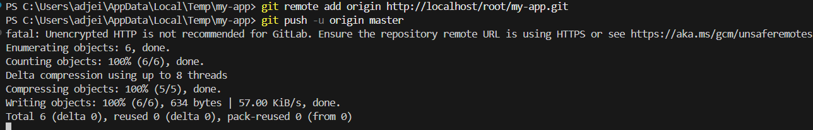
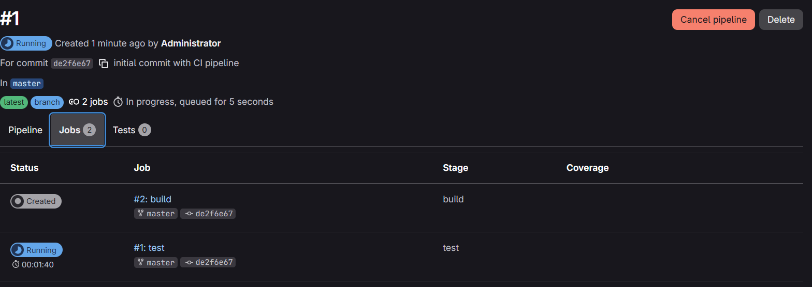

# Setting Up a Local GitLab Server

This covers running a GitLab CE instance locally with Docker, registering a runner, and getting a basic CI pipeline working.

## What you need

- Docker Desktop (Windows or Mac) or Docker Engine (Linux)
- At least 4GB of free RAM
- Git

## 1. Start GitLab

The `docker-compose.yml` defines the GitLab service. A few things worth knowing about the config:

- `puma['worker_processes'] = 0` and `sidekiq['max_concurrency'] = 5` reduce memory usage for local dev
- `prometheus_monitoring['enable'] = false` turns off metrics you do not need locally
- The runner container mounts the Docker socket so it can spin up sibling containers to run CI jobs
- Port `2222` maps to SSH for git operations over SSH (optional if you use HTTP)

Start the containers:

```bash
docker compose up -d
```

The first run downloads `gitlab/gitlab-ce:latest` which is around 1.8GB. Wait for it.

Watch the logs until you see `gitlab Reconfigured!`:

```bash
docker logs -f gitlab
```

This takes around 5 minutes.





## 2. Log in

GitLab generates a random root password on first boot. Get it with:

```bash
docker exec -it gitlab grep 'Password:' /etc/gitlab/initial_root_password
```

This file is deleted after 24 hours so save the password or change it immediately.

Open `http://localhost` and log in as `root` with that password.





## 3. Register a runner

### Create the runner in GitLab UI

1. Go to Admin Area > CI/CD > Runners
2. Click New instance runner
3. Tick Run untagged jobs so jobs without tags are picked up
4. Click Create runner and copy the token

### Register from the command line

```bash
docker exec -it gitlab-runner gitlab-runner register
```

When prompted:

```
GitLab instance URL: http://gitlab
Registration token: <your token>
Description: docker-runner
Tags: leave blank
Executor: docker
Default Docker image: alpine:latest
```

The URL is `http://gitlab` (the container name) not `http://localhost`. Inside the runner container, `localhost` points to itself. Docker's internal DNS resolves the container name `gitlab` to the right IP.

Once registered the runner shows as Online in the admin UI.



## 4. Create a project

In the GitLab UI:

1. New project > Create blank project
2. Name it `my-app`
3. Set visibility to Private
4. Uncheck "Initialize repository with a README"

## 5. Define the CI pipeline

Create `.gitlab-ci.yml` in your project root:

```yaml
stages:
  - test
  - build

test:
  stage: test
  image: node:20
  script:
    - npm test

build:
  stage: build
  image: node:20
  script:
    - npm run build
```

Two stages run sequentially on every push. Each job gets a fresh `node:20` container so the environment is always clean. The test stage must pass before build runs.

## 6. Push and verify

```bash
git init
git remote add origin http://localhost/root/my-app.git
git add .
git commit -m "initial commit"
git push -u origin main
```

Go to my-app > Build > Pipelines and watch the pipeline trigger.





## Troubleshooting

**Docker Desktop not running**

```
open //./pipe/dockerDesktopLinuxEngine: The system cannot find the file specified.
```

Launch Docker Desktop and wait for it to show "running" before retrying.

**GitLab image size**

GitLab CE bundles PostgreSQL, Redis, Nginx, and the Rails app in one image (~1.77GB). There is no slim version.

**Pipeline stuck on pending**

Go to Admin > Runners and confirm Run untagged jobs is enabled. Without it, jobs with no tags are silently ignored.

## Resources

- [GitLab Docker docs](https://docs.gitlab.com/ee/install/docker.html)
- [GitLab Runner registration docs](https://docs.gitlab.com/runner/register/)
- [GitLab CI/CD YAML reference](https://docs.gitlab.com/ee/ci/yaml/)
